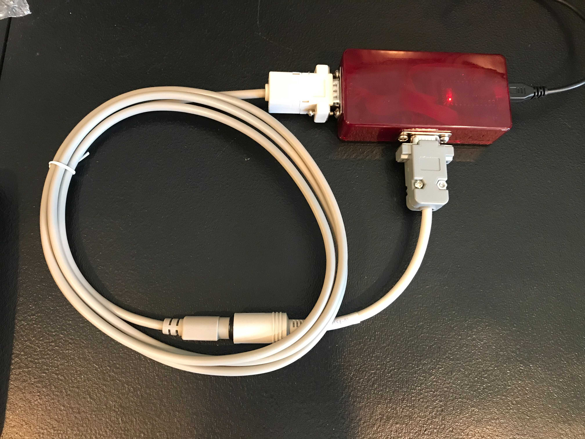

# CableTester
Arduino program to test (you guessed it) cables with a Teensy LC.
[ADTPro](https://retrofloppy.com/products/#SerialCables) serial cables, specifically.

## The Game Plan

Wire up
connectors that accept the mates of both ends of a
cable to pins on the Teensy, then ask it if the
expected pins are connected—and ensure no connection
exists where one shouldn't be, one pin at a time,
checking against all possible pins on the other end.

## Build

To make the tester "universal" (for DIN5 and MiniDIN8 cables), I created
whips for the different cable types

## Expected cable pinouts

Cable recipes are from the ADTPro project:
https://adtpro.com/connectionsserial.html
